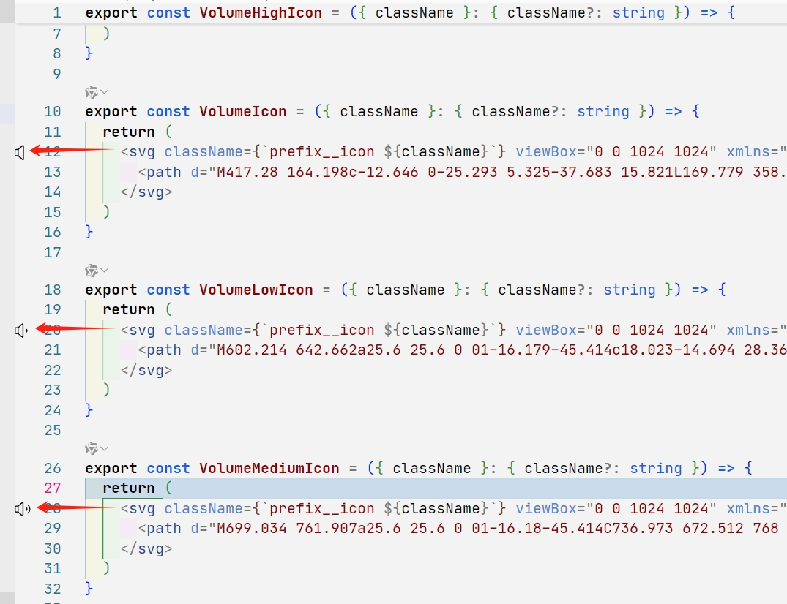

# Show Svg Preview

Show svg preview icon in vscode gutter

## Usage
- Out-of-the-box
- Supports Vue and React
- When the file extension is .vue, .jsx, or .tsx, the `<svg>` images will be displayed in the gutter of VSCode

## example
